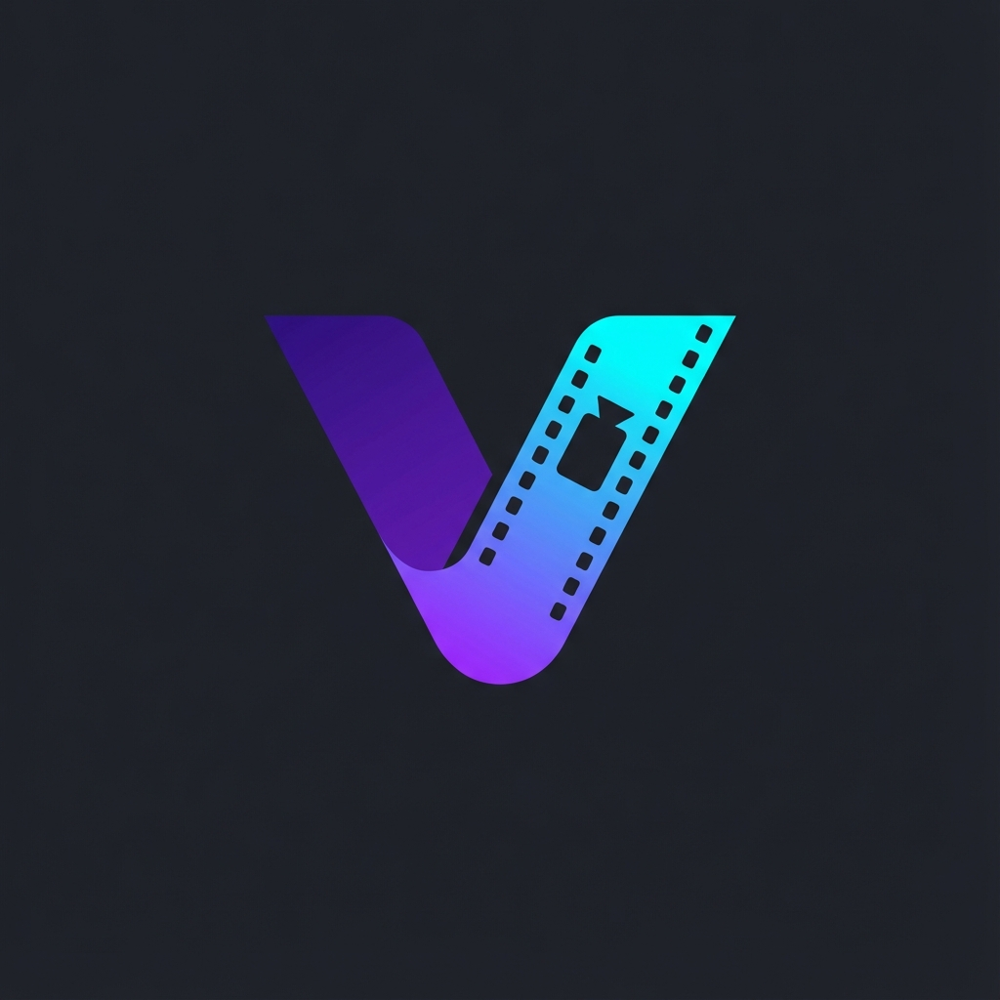

<p align="center">
  
</p>

<h1 align="center">Visionarr</h1>

<p align="center">
  <strong>Automatic Dolby Vision Profile 7 → Profile 8 Converter</strong><br>
  Automatically scans media libraries and converts DoVi for better device compatibility.
</p>

<p align="center">
  <a href="#why">Why?</a> •
  <a href="#how-it-works">How It Works</a> •
  <a href="#quick-start">Quick Start</a> •
  <a href="#features">Features</a>
</p>

---

## Why?

**Dolby Vision Profile 7** was designed for UHD Blu-ray discs. It uses a **dual-layer** format:
- **Base layer:** Standard HDR10 video
- **Enhancement layer:** Additional Dolby Vision metadata (MEL/FEL)

This dual-layer design works great in physical Blu-ray players, but causes problems with streaming:

| Problem | What Happens |
|---------|--------------|
| **Transcoding Triggers** | Plex/Jellyfin/Emby may not recognize client compatibility and trigger unnecessary transcoding |
| **Layer Stripping** | Some devices (Shield, Infuse) can't decode dual-layer, so they strip the DoVi layer and fall back to HDR10 |
| **Playback Failures** | Some players simply refuse to play Profile 7 content |

**Dolby Vision Profile 8** is a **single-layer** format designed for streaming. It embeds the DoVi metadata directly into the video stream, providing:
- ✅ Universal device compatibility
- ✅ No transcoding triggers
- ✅ Full Dolby Vision quality preserved

## How It Works

```
Profile 7 MKV → Extract HEVC → Convert RPU Metadata → Remux → Profile 8 MKV
```

**No transcoding occurs.** The video stream is copied bit-for-bit. Only the Dolby Vision metadata (RPU) is modified, meaning:
- ✅ No quality loss
- ✅ Fast processing (disk I/O bound, ~5-10 min for 50GB file)
- ✅ No GPU required

## Features

- 🔄 **Scheduled Scans** - Delta scan every 30 min, full scan weekly
- 🖥️ **Manual Mode** - Interactive console for one-off conversions
- 🛡️ **Atomic Safety** - Original files backed up before replacement
- 📊 **State Tracking** - SQLite database prevents reprocessing
- 🔔 **Notifications** - Optional Discord/Slack webhooks
- 🐳 **Docker Ready** - Includes Unraid template

## Requirements

- Docker (recommended) or:
  - Python 3.12+
  - ffmpeg
  - mkvtoolnix (mkvmerge)
  - dovi_tool
  - mediainfo

## Quick Start

```bash
docker run -d \
  -v /path/to/movies:/movies \
  -v /path/to/tv:/tv \
  -v /path/to/config:/config \
  ghcr.io/beltakoda/visionarr

# Then complete initial setup:
docker exec -it visionarr menu
```

## Configuration

See [.env.example](.env.example) for all available options.

| Variable | Default | Description |
|----------|---------|-------------|
| `DELTA_SCAN_INTERVAL_MINUTES` | 30 | How often to scan for new files |
| `FULL_SCAN_DAY` | sunday | Day of week for full library scan |
| `FULL_SCAN_TIME` | 03:00 | Time for full scan (24h format) |
| `BACKUP_ENABLED` | true | Keep .original backup files |

## License

MIT
